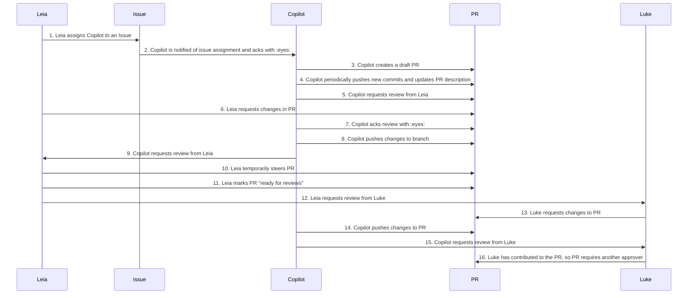

# PR Review Flow

```mermaid
sequenceDiagram
    participant Leia
    participant Issue
    participant Copilot
    participant PR
    participant Luke
    
    Leia->>Issue: 1. Leia assigns Copilot to an Issue
    Issue->>Copilot: 2. Copilot is notified of issue assignment and acks with :eyes:
    Copilot->>PR: 3. Copilot creates a draft PR
    Copilot->>PR: 4. Copilot periodically pushes new commits and updates PR description
    Copilot->>PR: 5. Copilot requests review from Leia
    Leia->>PR: 6. Leia requests changes in PR
    Copilot->>PR: 7. Copilot acks review with :eyes:
    Copilot->>PR: 8. Copilot pushes changes to branch
    Copilot->>Leia: 9. Copilot requests review from Leia
    Leia->>PR: 10. Leia temporarily steers PR
    Leia->>PR: 11. Leia marks PR "ready for reviews"
    Leia->>Luke: 12. Leia requests review from Luke
    Luke->>PR: 13. Luke requests changes to PR
    Copilot->>PR: 14. Copilot pushes changes to PR
    Copilot->>Luke: 15. Copilot requests review from Luke
    Luke->>PR: 16. Luke has contributed to the PR, so PR requires another approver
```
