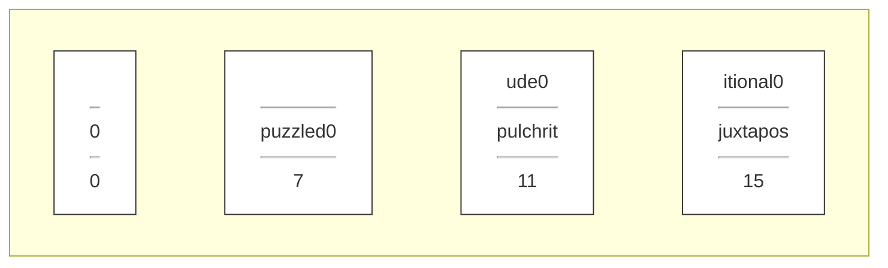
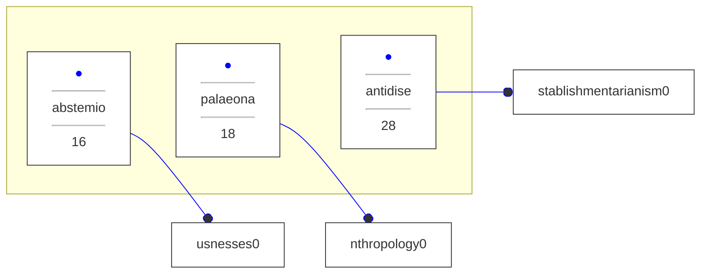
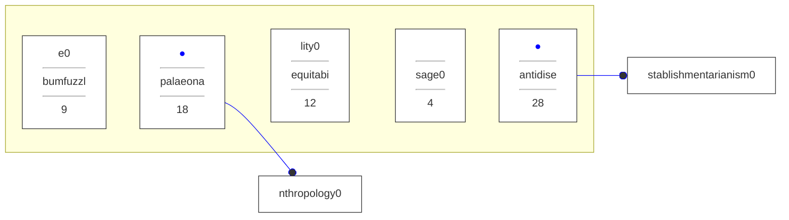

# CS107 Computer Organization & Systems - Fall 2023 Final Exam

```json
{
  "exam_id": "cs107_computer_organization_&_systems_fall_2023_final",
  "test_paper_name": "CS107 Computer Organization & Systems: Fall 2023 Final Exam",
  "course": "CS107 Computer Organization & Systems",
  "institution": "Stanford University",
  "year": 2023,
  "score_total": 40,
  "num_questions": 3
}
```

---

## Question 1 [10 points]

Attention: You don’t need to `#include` any libraries, and you needn’t use `assert` to guard against any errors. Understand that most points are awarded for concepts taught in CS107, and not prior classes. You don’t get many points for `for`-loop syntax, but you certainly get points for proper use of `&`, `*`, and the low-level C functions introduced in the course.

You're working with a custom string data type defined as follows:

```c
struct string {
    size_t length;
    char chars[16];
};
```

The string record is 24 bytes in size and allows for the storage of arbitrarily long strings, where the full length of the string is always stored in the `length` field. When the string itself is of length 15 or less, all characters—including the `'\0'` are stored in the `string`'s `chars` field. So, the strings `""`, `"puzzled"`, `"pulchritude"`, and `"juxtapositional"` could be represented in memory as:



Note that I use `0` to represent a `'\0'`, and uninitialized characters or characters that don't matter are left as blank in the drawing.

When the string is of length 16 or more, the storage format is different. Specifically, the first 8 characters are stored in indices 0 through 7, inclusive, but the remaining eight characters—equivalently, the remaining `sizeof(char *)` bytes—collectively store the address of a traditional C string external to the struct. That C string stores all remaining characters—i.e.,the characters at indices 8 and higher. So, `"abstemiousnesses"`, `"palaeoanthropology"`, and the infamous `"antidisestablishmentarianism"` would be represented as:



You're to implement a function called `serialize`, which accepts an array of these `struct`s and returns a single, **traditional**, dynamically allocated C string that’s the ordered concatenation of all the strings stored in the array. So, given the following array of length 5:



your `serialize` function should return a dynamically allocated C string—namely, a heap-based C string:

`"bumfuzzlepalaeoanthropologyequitabiltysageantidisestablishmentarianism"`

Your implementation should make a single pass over the array, reallocating the initially `strdup`'ed empty string and appending the characters of each `struct string` in turn.

Use the rest of this page to provide your implementation:

```c
char *serialize(struct string strings[], size_t length) {
  char *serialization = strdup("");
  // any other variable declarations below

  for (int i = 0; i < length; i++) {
    // complete the body of the for loop


  }

  return serialization;

}
```

Your answer should be a complete implementation of the `serialize` function as described above.

```json
{
  "problem_id": "1",
  "points": 10,
  "type": "Freeform",
  "tags": ["c-programming", "struct-memory-layout", "dynamic-memory-allocation"],
  "answer": "```\nchar *serialize(struct string strings[], size_t len) {\n    char *serialization = strdup(\"\");\n    size_t length = 0;\n    for (size_t i = 0; i < len; i++) {\n        serialization = realloc(serialization, length + strings[i].length + 1);\n        if (strings[i].length <= 15) {\n            strcpy(serialization + length, strings[i].chars);\n        } else {\n            strncpy(serialization + length, strings[i].chars, 8);\n            strcpy(serialization + length + 8, *(char **) &strings[i].chars[8]);\n        }\n        length += strings[i].length;\n    }\n    return serialization;\n}\n```",
  "comments": "Expect proper pointer casting when accessing the external char* within the chars[16] array and correct management of the heap-allocated serialization string.",
  "llm_judge_instructions": "The answer is one correct implementation of the serialize function as described. Award full points for a correct and efficient implementation that handles both short and long strings properly. Partial credit may be given for partially correct implementations that demonstrate understanding of the memory layout and dynamic allocation."
}
```

---

## Question 2 [20 points]

Attention: You don’t need to `#include` any libraries, and you needn’t use `assert` to guard against any errors. Understand that most points are awarded for concepts taught in CS107, and not prior classes. You don’t get many points for `for`-loop syntax, but you certainly get points for proper use of `&`, `*`, and the low-level C functions introduced in the course.

The assembly code presented below was generated by compiling a function called `allspice` without optimization—i.e., using `-Og`.

```assembly
0x1149 <+0>: push %rbp
0x114a <+1>: push %rbx
0x114b <+2>: sub $0x28,%rsp
0x114f <+6>: mov %rdi,%rbp
0x1152 <+9>: mov %rsi,0x8(%rsp)
0x1157 <+14>: mov (%rsi),%rbx
0x115a <+17>: sub %rdi,%rbx
0x115d <+20>: mov %rbx,0x18(%rsp)
0x1162 <+25>: mov 0x18(%rsp),%rax
0x1167 <+30>: add %rax,%rax
0x116a <+33>: cmp %rbx,%rax
0x116d <+36>: jbe 0x11af <allspice+102>
0x116f <+38>: lea 0x18(%rsp),%rcx
0x1174 <+43>: lea 0x8(%rsp),%rdx
0x1179 <+48>: mov %rbp,%rsi
0x117c <+51>: mov $0x1,%edi
0x1181 <+56>: mov $0x0,%eax
0x1186 <+61>: callq 0x1050 <printf@plt>
0x118b <+66>: mov 0x18(%rsp),%rax
0x1190 <+71>: not %rax
0x1193 <+74>: test $0x7,%al
0x1195 <+76>: je 0x11af <allspice+102>
0x1197 <+78>: mov 0x8(%rsp),%rsi
0x119c <+83>: mov 0x8(%rsi),%rdi
0x11a0 <+87>: callq 0x1149 <allspice>
0x11a5 <+92>: mov %rax,0x18(%rsp)
0x11aa <+97>: add %rax,%rbx
0x11ad <+100>: jmp 0x1162 <allspice+25>
0x11af <+102>: mov 0x18(%rsp),%rax
0x11b4 <+107>: add $0x28,%rsp
0x11b8 <+111>: pop %rbx
0x11b9 <+112>: pop %rbp
0x11ba <+113>: retq
```

### a) [12 points]

First, fill in the blanks below so that `allspice` is programmatically consistent with the unoptimized assembly you see above. Note that the C code is nonsense and should just be a faithful reverse engineering of the assembly. You may not typecast anything.

Note: `printf` is a special function that expects its first three arguments to be passed through `%rsi`, `%rdx`, and `%rcx`, in that order. `%rdi` isn’t used to pass traditional parameters when printf is called.

```c
size_t allspice(char *mustard, char *cardamon[]) {

    size_t cinnamon = ________________________________;

    for (size_t i = ___________; ___________; ___________) {

        printf(___________, ___________, ___________);

        if (___________________________) ;

        cinnamon = allspice(___________, ___________);
    }

    return ________________;

}
```

Your answer should be a complete implementation of the `allspice` function as described above.

```assembly
0x1170 <+0>: push %r13
0x1172 <+2>: push %r12
0x1174 <+4>: push %rbp
0x1175 <+5>: push %rbx
0x1176 <+6>: sub $0x28,%rsp
0x117a <+10>: mov (%rsi),%rbx
0x117d <+13>: mov %rsi,0x8(%rsp)
0x1182 <+18>: sub %rdi,%rbx
0x1185 <+21>: lea (%rbx,%rbx,1),%rax
0x1189 <+25>: mov %rbx,0x18(%rsp)
0x118e <+30>: cmp %rax,%rbx
0x1191 <+33>: jae 0x11f0 <allspice+128>
0x1193 <+35>: mov %rdi,%rbp
0x1196 <+38>: lea 0x18(%rsp),%r13
0x119b <+43>: lea 0x8(%rsp),%r12
0x11a0 <+48>: mov %r12,%rdx
0x11a3 <+51>: xor %eax,%eax
0x11a5 <+53>: mov %r13,%rcx
0x11a8 <+56>: mov %rbp,%rsi
0x11ab <+59>: mov $0x1,%edi
0x11b0 <+64>: callq 0x1050 <printf@plt>
0x11b5 <+69>: mov 0x18(%rsp),%rax
0x11ba <+74>: mov %rax,%rdx
0x11bd <+77>: not %rdx
0x11c0 <+80>: and $0x7,%edx
0x11c3 <+83>: je 0x11e4 <allspice+116>
0x11c5 <+85>: mov 0x8(%rsp),%rsi
0x11ca <+90>: mov 0x8(%rsi),%rdi
0x11ce <+94>: callq 0x1170 <allspice>
0x11d3 <+99>: add %rax,%rbx
0x11d6 <+102>: lea (%rax,%rax,1),%rdx
0x11da <+106>: mov %rax,0x18(%rsp)
0x11df <+111>: cmp %rbx,%rdx
0x11e2 <+114>: ja 0x11a0 <allspice+48>
0x11e4 <+116>: add $0x28,%rsp
0x11e8 <+120>: pop %rbx
0x11e9 <+121>: pop %rbp
0x11ea <+122>: pop %r12
0x11ec <+124>: pop %r13
0x11ee <+126>: retq
0x11ef <+127>: nop
0x11f0 <+128>: add $0x28,%rsp
0x11f4 <+132>: mov %rbx,%rax
0x11f7 <+135>: pop %rbx
0x11f8 <+136>: pop %rbp
0x11f9 <+137>: pop %r12
0x11fb <+139>: pop %r13
0x11fd <+141>: retq
```

Now, study the more aggressively optimized version of `allspice` presented above, and answer the questions below.

### b) [2 points]

Note that both the unoptimized and optimized versions some caller-owned registers to the stack but then proceeds to modify `%rsp` without having pushed its value to the stack. However, you also know that `%rsp` is caller-owned as well, even though it’s not being pushed to the stack. Why does, say, `%rbp` needs to be pushed to the stack while `%rsp` doesn’t need to be?

Your answer should be a brief explanation.

### c) [2 points]

It should be evident that the number of instructions emitted when `-O2` is used is much higher than the number emitted with `-Og`. Explain why the number of instructions executed by a typical call to `allspice` will, in practice, still be smaller.

Your answer should be a brief explanation.

### d) [2 points]
Notice that 5 of the final 6 instructions appear earlier, in the same order, at offsets `+116` through `+126`, and that the `mov %rbx, %rax` at offset `+132` is the only one not replicated. Knowing that you could, in theory, implement the `allspice` directly in x86-64 yourself, by hand, explain how you might use most of what’s presented to the right (which is a copy of what’s on the previous page) while reordering a few instructions and updating one or more jump offsets so that only one copy of these five instructions is needed instead of two.

Your answer should be a brief explanation.

### e) [2 points]

At offset `+51`, you’ll see an `xor` instruction. What line in the unoptimized version does that correspond to? In what sense is the `xor` alternative considered an optimization?

Your answer should be a brief explanation.

```json
{
  "problem_id": "2",
  "points": 20,
  "type": "Freeform",
  "tags": ["x86-64-assembly", "reverse-engineering", "compiler-optimizations"],
  "answer": "a) \n```\nsize_t allspice(char *mustard, char *cardamon[]) {\n    size_t cinnamon = cardamon[0] - mustard;\n    for (size_t i = cinnamon; i < 2 * cinnamon; i += cinnamon) {\n        printf(mustard, &cardamon, &cinnamon);\n        if ((~cinnamon & 0x7) == 0) break;\n        cinnamon = allspice(cardamon[1], cardamon);\n    }\n    return cinnamon;\n}\n```\n\nb) The callee's only responsibility it to ensure that a caller-owned register is restored to its original value prior to exit should the callee change it during its own execution. As you see from the assembly, %rsp is demoted by several bytes to make space for local variables, but prior to any call to retq, it's promoted to its original value. There's no specific obligation to use pushq and popq.\n\nc) The real win here is that the number of instructions within the loop has gone down dramatically. Compilers typically assume a loop will iterate many, many times, so if static instruction goes up but dynamic instruction count goes down, then that's still a substantial optimization.\n\nd) The `mov` instruction at +132 could be replicated to appear in between what’s currently at +114 and +116. Then update the `jae` at +33 to jump to this replicated `mov` instruction and the update the `je` at +83 to jump to the instruction after this replicated move. You can then get rid of the `nop` orginally at +147 and everything beyond it.\n\ne) Any bit pattern exclusive-or’ed with itself generates a zero, so that `xor` instruction has the effect of zeroing out `%eax`. The unoptimized code achieves the same thing using a `mov $0, %eax` instruction. So, what’s the optimization? That `xor` instruction is encoded in just two bytes, and the `mov` instruction is encoded as a five-byte instruction.",
  "comments": "Focus on the mapping between assembly registers/offsets and C variables, and the conceptual understanding of why -O2 produces different code structures.",
  "llm_judge_instructions": "a) (12 points): Award points based on correct mapping of assembly to C code. Full points for a complete and correct implementation. b) (2 points): Award full points for understanding of caller/callee responsibilities regarding registers. c) (2 points): Award full points for understanding of dynamic vs static instruction counts in optimization. d) (2 points): Award full points for understanding of instruction reordering and jump offset adjustments. e) (2 points): Award full points for identifying the corresponding line and explaining the optimization."
}
```

---

## Question 3 [10 points]

Attention: You don’t need to `#include` any libraries, and you needn’t use `assert` to guard against any errors. Understand that most points are awarded for concepts taught in CS107, and not prior classes. You don’t get many points for `for`-loop syntax, but you certainly get points for proper use of `&`, `*`, and the low-level C functions introduced in the course.

### a) [5 points]

You’ve been hired as a security engineer to scrutinize some crucial authentication code to see how someone might access a website even though they don’t have the proper credentials to do so. The key function to examine is below:

```c
#define MAX_ATTEMPTS 3
bool login() {
  size_t canary1 = rand_size_t(); // generates random size_t
  char actual[16];
  size_t canary2 = canary1;
  char supplied[16];

  strcpy(actual, retrieve_password()); // assume no issues
  size_t attempts = 0;
  while (attempts < MAX_ATTEMPTS) {
    printf("Enter password: ");
    gets(supplied);
    if (canary1 != canary2) {
      printf("Hacking attempt! Aborting login!\n");
      return false;
    }
    if (strncmp(supplied, actual, 16) == 0) return true;
    printf("Supplied password failed. Try again!\n");
    attempts++;
  }
  printf("Max attempts exceeded.\n");
  return false;
}
```

Note the truly daft use of `gets`, which reads a line from `stdin` and places whatever is typed into the `supplied` character array, where no checks for overflow are performed whatsoever. In the context of `login`, if the user types in the seven-letter `"abcdefg"` or even the 15-letter `"abcdefghijklmno"`, there’s enough space for the 8 or 16 bytes needed to store them. However, if the user types in the full lowercase alphabet, 27 bytes would be written to flood the `supplied` array and overflow beyond its last allocated byte.

You admire, however, the use of ***canaries***, which are special values used to detect buffer overflow. In this case, `canary1` and `canary2` are set to the same randomly generated 64-bit value. The assumption here is that any overflow of `supplied`—intentional or not—changes `canary2` and prompts `login` to return `false` right away after printing a panicky message.

By examining the assembly code for the `login` function, you determine the five local variables are laid out as presented as drawn in the diagram (represented as markdown table) below. The smaller rectangles are 8-byte `size_t`s, larger rectangles are 16-byte `char` arrays. And note that the return address—that is, the saved rip value necessary for function call and return to work—rests right on top of the stack frame. 

| ret addr|
| :---: |
| `canary1` |
| <br/>`actual`<br/>&nbsp; |
| `canary2` |
| <br/>`supplied`<br/>&nbsp; |
| `attempts` |

Referring to the `login` implementation and the stack diagram of locals, you explain to those who’ve hired you that someone can be granted access to the website—that is, fool `login` to return `true`—regardless of whatever `retrieve_password` returns (save that it returns a C string of length 15 or less, which you can assume to be the case).

#### a.1 [3 points]

You have the idea of entering 47 `'0'`s as the first password and then 23 `'0'`s as the second password, and you try. How far do you get? Leveraging your understanding of how the stack organizes `login`'s local variables as per the diagram on the prior page, explain why this won’t work.

Your answer should be a brief explanation.

#### a.2 [2 points]

Now explain why a single supplied password of 48 `'a'`'s in a row might allow `login` to stage a `true` as a return value, only to crash or cause other problems as it attempts to pass control back to the caller. But also explain why entering 48 `'a'`'s might actually work without a problem, and what must be true for that to happen.

Your answer should be a brief explanation.

### b) [5 points]

You learn of a nifty `get_function_by_address` with the following prototype:

```c
struct func_info {
  char *name; // e.g., main, printf, mymalloc, level_1, etc.
  void *start; // address of first x86-64 instruction
  void *end; // address of last x86-64 instruction
};
bool get_function_by_address(void *addr, struct func_info *info);
```

`get_function_by_address` accepts an arbitrary memory address and returns `true` if and only if the supplied address is that of an assembly code instruction in the code segment, and `false` otherwise. When `true` is returned, the record addressed by `info` is populated with information about the function itself. (When `false` is returned, the `struct` addressed by `info` is unchanged.)

You’re inspired to implement a `backtrace` function to imitate the functionality of `gdb`'s `backtrace` command. Your `backtrace` function identifies the sequence of currently active function calls that have yet to return and prints their names. This is your implementation:

```c
void backtrace() {
  struct func_info info;
  void **start = &info;
  while (true) {
    if (get_function_by_address(*start, &info)) {
      printf("%s\n", info.name);
      if (strcmp(info.name, "main") == 0) return;
    }
    start++;
  }
}
```

So, if `main` calls `foo` calls `bar` calls `baz` calls `pop` calls `backtrace`, the call to `backtrace` would print:

```
pop
baz
bar
foo
main
```

and then return.

After studying the implementation on the prior page, answer the following questions, limiting your responses to at most 75 words.

#### b.1 [3 points]

Briefly explain how and why the `backtrace` function works. Specifically, explain what types of values on the stack prompt the `get_function_by_address` to return `true`, and also explain why `start` is initialized to `&info`.

Your answer should be a brief explanation no more than 75 words.

#### b.2 [2 points]

You’re convinced the general implementation is pretty good, but then you realize that **function pointers** can be passed as parameters and stored in local variables, and you don’t want the names of the functions they address to be printed just because they’re stored on the stack. Describe how you might change the implementation of `get_function_by_address` to only print the names of functions that are currently executing without printing the names of functions simply function pointers are passed as parameters or stored as local variables.

Your answer should be a brief explanation no more than 75 words.

```json
{
  "problem_id": "3",
  "points": 10,
  "type": "Freeform",
  "tags": ["runtime-stack", "buffer-overflow", "stack-backtrace", "security"],
  "answer": "a) \na.1 You don’t get very far at all because the last (highest-address) byte of `canary1` would be a true zero-byte—that is, a `'\\0'`—whereas the last byte of `canary2` would store the ASCII code of the digit character `'0'`. That two canaries would be immediately flagged as unequal, and the function would return `false` after printing an angry message.\na.2 To write 48 `'a'`'s is really to write 49, the 49th being a `'\\0'` that gets written in the first byte of the return address. The canaries and passwords match, so `true` will be staged in `%eax`, but `retq` might pop a malformed address! If the `'\\0'` overwrites a nonzero byte, the address might be invalid, and an attempt to execute that instruction might cause a crash. If that `'\\0'`overwrites another `'\\0'`, execution proceeds as normal.\n\nb) \nb.1 `&info` is the lowest meaningful stack address at the time `info` is declared. The stack frames of all functions are, well, stacked at higher addresses, and each stack frame is separated from the one below by a return address. The loop in `backtrace` walks the stack as an array of 64-bit values, and each time one is an address within some function, the function name gets printed. Everything stops when that function name is `\"main\"`.\nb.2 Modify test to check if the return value of `get_function_by_address` is `true` and that `*start` is strictly greater than `info.start`. If so, then the name of the function can be printed as it has been. If `*start == info.start`, then `*start` is a function pointer and should be skipped.",
  "comments": "Evaluation should focus on the student's ability to visualize the stack growth (downwards) and how linear overflows affect specific memory slots (canaries vs return addresses).",
  "llm_judge_instructions": "a) (5 points): a.1 (3 points): Award points for understanding of canary comparison and stack layout. a.2 (2 points): Award points for understanding of return address corruption and conditions for successful execution. b) (5 points): b.1 (3 points): Award points for understanding of stack frame traversal and function address identification. b.2 (2 points): Award points for understanding of function pointer differentiation from return addresses."
}
```

---