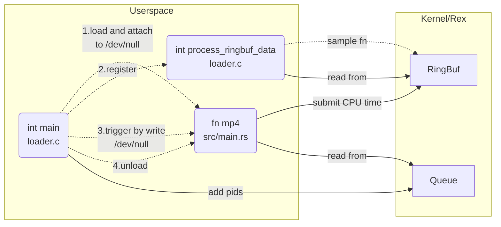

# MP4: Rex kernel extensions

> [!IMPORTANT]
> For this MP you need work on the x86-64 architecture. We assume the x86-64 architecture and ABI in this writeup. Engineering-IT has provided x86-64 VMs for all students, please refer to Piazza post for the access.
> 
> This documentation is shipped with your starter code, but please always refer to https://github.com/cs423-uiuc-fall25/rex-mp4-template for the most recent version.
>
> Claim this MP at https://classroom.github.com/a/DeVJRMF3

## Introduction

The emergence of verified eBPF bytecode is ushering in a new era of safe kernel extensions. In this paper, we argue that eBPF’s verifier—the source of its safety guarantees—has become a liability. In addition to the well-known bugs and vulnerabilities stemming from the complexity and ad hoc nature of the in-kernel verifier, we highlight a concerning trend in which escape hatches to unsafe kernel functions (in the form of helper functions) are being introduced to bypass verifier-imposed limitations on expressiveness, unfortunately also bypassing its safety guarantees. We propose safe kernel extension frameworks using a balance of not just static but also lightweight runtime techniques. We describe a design centered around kernel extensions in safe Rust that will eliminate the need of the in-kernel verifier, improve expressiveness, allow for reduced escape hatches, and ultimately improve the safety of kernel extensions.

The basic ideas are documented in original [README](./REX.md) and [this ATC'25 paper](https://www.usenix.org/system/files/atc25-jia.pdf) (no need to read through).

## Problem Description

Your task is to implement a Rex kernel extension program that reads and pass CPU time for registered pids between kernel and userspace (the same as what we did in mp1). This is conceptually straightforward. However, the real challenge lies in mastering Rex operations and integrating them with your knowledge of Linux kernel programming, Rust programming, and other essential aspects like ELF (Executable and Linkable Format). This task will test your technical skills and ability to quickly adapt to new programming environments.

To implement the program, your objective is to

1. Write a Rex program (`samples/mp4/src/main.rs`) that reads pids from the queue, looks up its CPU time and pass the result to the ring buffer. Static definition of queue and ring buffer are already provided. (10 points)

   Skip if the process doesn't exist or pid is invalid (10 points)
2. Write a C program (`samples/mp4/loader.c`) that
   - Downloads (to kernel) the Rex program above and hook it upon writes to `/dev/null` (the hook is already provided above) (10 points)
   - Passes pids from arguments to the queue (10 points)
   - Uses `process_ringbuf_data` to print CPU time (utime, stime not supported yet in Rex) from ring buffer. The format should be the same as in [mp1](https://github.com/cs423-uiuc/cs423-uiuc.github.io/blob/master/fall25/mps/MP1.md#problem-description) (10 points)
   - Triggers the aforementioned Rex program by writting anything to `/dev/null` (10 points)

3. Your code is well commented, readable (5 points)

   and warning-free during compiling and running (5 points)

**Total points: 70**. You will lost dependent points if depended implementation is not correct and affects dependent result.

> [!TIP]
> We provide a test script (`samples/mp4/test.sh`) to help check your implementation by yourselves.
>
> Useful references: [eBPF Docs](https://docs.ebpf.io/ebpf-library/libbpf/userspace/), [Rex README](./Rex.md)

**Overall Structure**



`...`: "meta" control flow

`-->`: data flow

## Environment Setup

#### Repo Setup

```bash
cd YOUR_MP4_REPO
git submodule update --init --progress
```

#### Dependencies Installation and Building Steps

Ubuntu 24 enabled [AppArmor](https://documentation.ubuntu.com/server/how-to/security/apparmor/) by default, which blocks nix from creating uid map in the sandbox. So you need to allow uid mapping by

```shell
echo "kernel.apparmor_restrict_unprivileged_userns = 0" | sudo tee /etc/sysctl.d/60-apparmor-namespace.conf
sudo systemctl restart systemd-sysctl
```

This change is persistent, next time you can follow [docs/getting-started.md](./docs/getting-started.md) directly. To be noted, submodule cloning and building can take a long time, you can try using [tmux](https://manpages.ubuntu.com/manpages/noble/en/man1/tmux.1.html) to keep the job running in background.

#### Run and Test

> [!IMPORTANT]
> You should launch QEMU VM inside nix shell (after `nix develop ...`)
- Try examples provided by Rex

    If you get such error:

    ```shell
    netid@fa25-cs423:~/mp4-name/build/linux$ ../../scripts/q-script/nix-q 
    Could not access KVM kernel module: Permission denied
    qemu-system-x86_64: failed to initialize kvm: Permission denied
    qemu-system-x86_64: falling back to tcg
    qemu-system-x86_64: CPU model 'host' requires KVM or HVF
    ```

    Add yourself to `kvm` group:

    ```shell
    sudo usermod -aG kvm $USER # then reboot the machine or run "newgrp kvm"
    ```

- Once you complete the implementation, you can test them out using `zsh test.sh`
