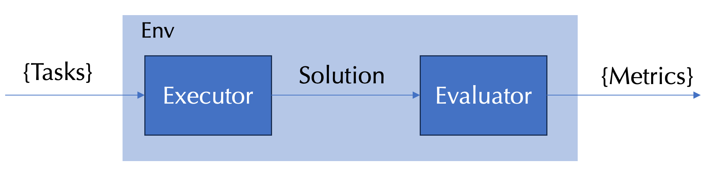

# Benchmark Abstraction

AI benchmarks are essential for evaluating model capabilities, guiding research directions, and measuring progress. A well-structured benchmark provides a systematic way to assess performance across various tasks and scenarios. Therefore, it is crucial to have a clear and modular design for benchmarks that can be easily understood, extended, and reused. The figure below illustrates our abstraction of an AI benchmark. We distill it into four key elements: the taskset, the environment, the executor, and the evaluator. Together, these components create a clear pipeline that connects tasks to measurable outcomes.

- **Taskset**: The benchmark begins with a taskset, which defines the collection of tasks to be solved. These tasks represent the problem instances, queries, or goals that the system under evaluation must handle. The taskset provides both the diversity and difficulty that shape the benchmark’s scope.

- **Environment (Env)**: The environment serves as the overarching container where execution and evaluation happen. It ensures that tasks are presented consistently, and it provides the necessary interfaces and constraints to enforce fairness across different systems or models.

- **Executor**: Within the environment, the executor is responsible for solving the tasks from the taskset. It interprets the input, runs the solution process, and produces outputs or actions that correspond to attempted solutions. The executor can be as simple as a single function call to a LLM API, or as complex as an agent that autonomously plan and call multiple tools in the environments.

- **Evaluator**: The evaluator takes the solutions produced by the executor and measures their performance. It applies objective criteria—such as correctness, efficiency, robustness, or quality and transforms these assessments into metrics. These metrics provide a standardized way to compare different systems or approaches on the same taskset.

This modular design enables flexibility and extensibility. By varying the taskset, environment, executor, or evaluator, new benchmarks can be created while preserving a consistent overall structure. This separation of concerns also allows components to be reused across different benchmarks. 

The complexity of each component depends on the benchmark’s goals. For example, in simple knowledge-based question answering (e.g., MMLU, Math benchmarks), the environment is minimal, tasks share common settings, and the executor may be a straightforward function call to an LLM API. The evaluator can then rely on direct comparisons between generated outputs and ground-truth answers. In contrast, coding-related benchmarks—such as system implementation, debugging, or performance analysis—require more sophisticated setups. Here, the environment may involve specialized hardware or software, with tasks demanding unique configurations. The evaluator must operate within the same environment as executor to assess whether an environment is successfully setup or debug is correctly fixed.

Although described in the context of system capabilities, this benchmark structure is broadly applicable. The clear delineation of taskset, environment, executor, and evaluator provides a versatile framework adaptable to diverse domains and problem types. By customizing individual components, benchmarks can be tailored to specific needs while maintaining methodological consistency.